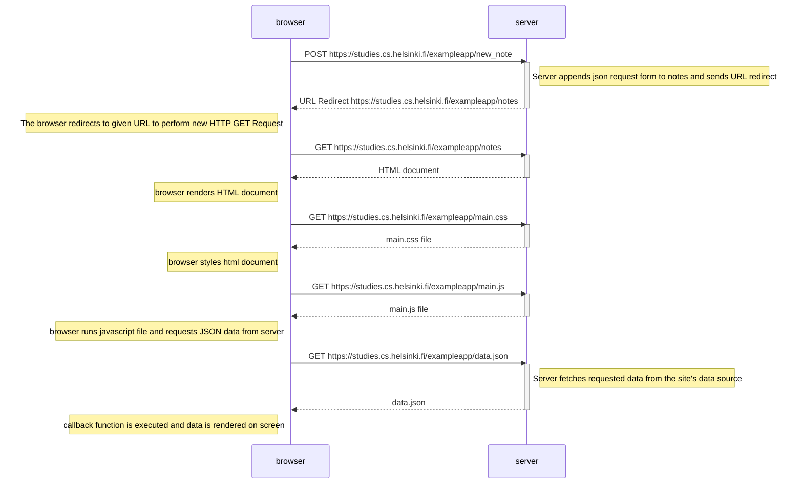

```mermaid
sequenceDiagram
    participant browser
    participant server

    browser ->> server: POST https://studies.cs.helsinki.fi/exampleapp/new_note
    activate server

    Note right of server: Server appends json request form to notes and sends URL redirect

    server -->> browser: URL Redirect https://studies.cs.helsinki.fi/exampleapp/notes

    deactivate server

    Note left of browser: The browser redirects to given URL to perform new HTTP GET Request

    browser ->> server: GET https://studies.cs.helsinki.fi/exampleapp/notes
    activate server
    server -->> browser: HTML document
    deactivate server

    Note left of browser: browser renders HTML document

    browser ->> server: GET https://studies.cs.helsinki.fi/exampleapp/main.css
    activate server
    server -->> browser: main.css file
    deactivate server

    Note left of browser: browser styles html document

    browser ->> server: GET https://studies.cs.helsinki.fi/exampleapp/main.js
    activate server
    server -->> browser: main.js file
    deactivate server

    Note left of browser: browser runs javascript file and requests JSON data from server

    browser ->> server: GET https://studies.cs.helsinki.fi/exampleapp/data.json
    activate server

    Note right of server: Server fetches requested data from the site's data source
    server -->> browser: data.json
    deactivate server

    Note left of browser: callback function is executed and data is rendered on screen
```