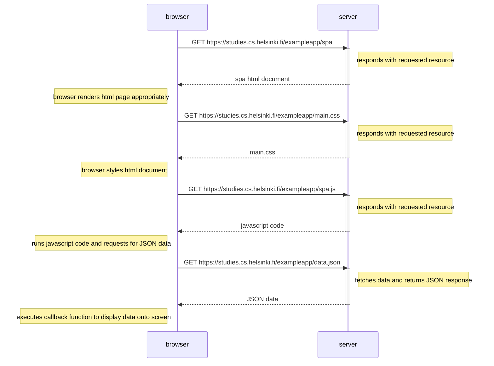

```mermaid
sequenceDiagram
    participant browser
    participant server

    browser ->> server: GET https://studies.cs.helsinki.fi/exampleapp/spa

    activate server

    Note right of server: responds with requested resource

    server -->> browser: spa html document
    deactivate server

    Note left of browser: browser renders html page appropriately


    browser ->> server: GET https://studies.cs.helsinki.fi/exampleapp/main.css

    activate server

    Note right of server: responds with requested resource

    server -->> browser: main.css
    deactivate server

    Note left of browser: browser styles html document 

    
    browser ->> server: GET https://studies.cs.helsinki.fi/exampleapp/spa.js

    activate server

    Note right of server: responds with requested resource

    server -->> browser: javascript code

    deactivate server

    Note left of browser: runs javascript code and requests for JSON data


    browser ->> server: GET https://studies.cs.helsinki.fi/exampleapp/data.json

    activate server

    Note right of server: fetches data and returns JSON response

    server -->> browser: JSON data

    deactivate server

    Note left of browser: executes callback function to display data onto screen
```