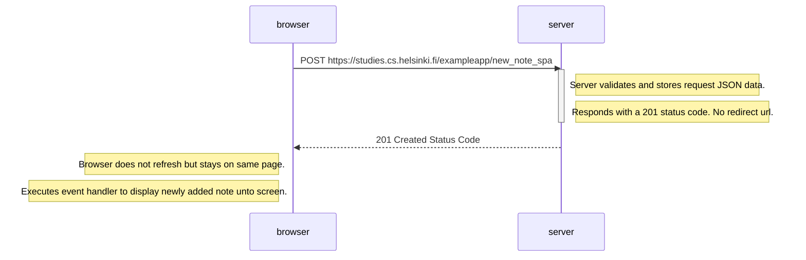

```mermaid
sequenceDiagram
    participant browser
    participant server

    browser ->> server: POST https://studies.cs.helsinki.fi/exampleapp/new_note_spa

    activate server

    Note right of server: Server validates and stores request JSON data. 
    Note right of server: Responds with a 201 status code. No redirect url.

    deactivate server

    server -->> browser: 201 Created Status Code

    Note left of browser: Browser does not refresh but stays on same page.
    Note left of browser: Executes event handler to display newly added note unto screen.
```